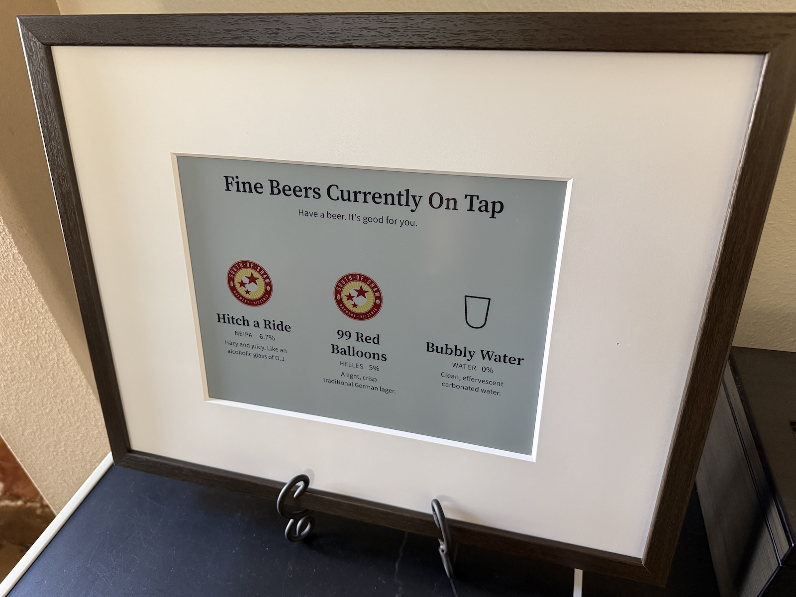

# Tapframe

Years ago I wrote a beer tap display for a TV mounted over my kegerator. After looking at that code and realizing how bad it looked, I decided to update it for the modern age.

Tapframe is a beer tap menu that lives on an e-ink display. I have a Fraimic, so that’s the first module. The rest of the app is built so other frames can plug in the same way.

If you write a display module, I’d love to include it here.



Cheers!

## Requirements

- Node.js 20.9 or newer
- [pnpm](https://pnpm.io) 10
- A machine with a disk (not a serverless host)
- For Fraimic: the app and the frame on the same local network; the frame must be awake

## Run

```bash
pnpm install
pnpm dev:setup
pnpm dev
```

Open [http://localhost:3001](http://localhost:3001). Development data lives
under `.dev/data/` and is never used by a production deployment. For mobile
testing on the local network, open port 3001 at this machine's LAN address.

```bash
pnpm test
pnpm build
TAPFRAME_DATA_DIR="$PWD/.dev/data" pnpm start
```

The manual production server uses [http://localhost:3000](http://localhost:3000).

## Deploy

Tapframe can run as an immutable standalone release from
`~/.local/share/tapframe`, independently of this checkout. User lingering lets
the service start at boot without an interactive login.

One-time installation:

```bash
pnpm production:install
pnpm production:deploy
```

Deployments require a clean `main` branch. They build the exact commit in a
temporary worktree, run the test and lint suites, snapshot production data,
atomically activate the release, and roll back automatically if the health
check fails.

```bash
pnpm production:deploy
pnpm production:status
pnpm production:logs
pnpm production:rollback
```

Production data is stored in `~/.local/share/tapframe/data`. Code rollback does
not roll back data. The deployer retains three code releases and five
pre-deploy data snapshots.

## Using it

The tap cards are left to right, same as the handles. A board holds as many beers as the selected display allows (Fraimic: four across, one row).

- **Save** writes the tap list
- **Generate preview** draws the menu at the selected display size
- **Send** renders that image and gives it to the display module
- **Settings** chooses the display, size, and device fields (frame address, and later a webhook or token)

## Data

There is no database. The tracked `data/` files seed a new development or
production data directory; running instances do not write back to those seed
files.

| File                | In git?     | What                                                      |
| ------------------- | ----------- | --------------------------------------------------------- |
| `data/taps.yaml`    | yes         | Headline, subtitle, ordered beers (sample list included)  |
| `data/display.yaml` | yes         | Display module, size, and field values (Fraimic defaults) |
| `data/logos/`       | folder only | Uploaded marks. Images you add are gitignored.            |

`TAPFRAME_DATA_DIR` selects the runtime data directory. It is mandatory in
production and defaults to `.dev/data` during development.

Each beer has a name, style, ABV, optional description, and optional logo. Missing logo uses a generic glass. Edit in the admin or in the YAML.

## Displays

Each device is a folder under `src/displays/`. The app never talks to a frame itself. It renders a PNG, then calls `adapter.send`.

| Module    | Notes                                                                                                |
| --------- | ---------------------------------------------------------------------------------------------------- |
| `fraimic` | Local REST API. Converts the PNG to a Spectra 6 `.bin` and POSTs it. Tap the frame to wake it first. |

**Settings** is where you pick the module when more than one is installed. Size, board (how many beers across / how many rows), and extra fields all come from that module’s definition.

How to add another device: [src/displays/README.md](src/displays/README.md).

## License

MIT. See [LICENSE](LICENSE).
